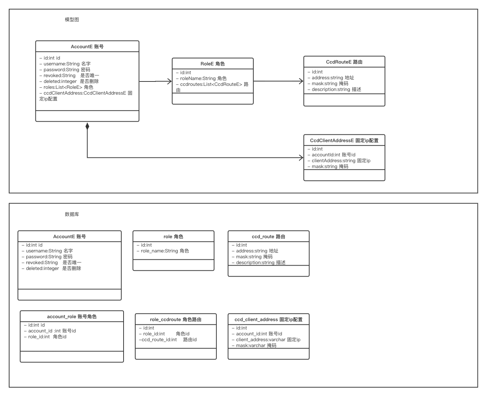

# ovpn-manager

## Features

* 新增openvpn用户;
* 使用角色管理，用户绑定角色，获取对应的权限
* 撤销/恢复用户证书;
* 生成可供用户使用的配置文件;
* 为 Prometheus 提供指标，包括证书到期日期、（已连接/总）用户数、已连接用户信;
* (optionally) Specifying CCD (`client-config-dir`) for each user;
* (optionally) Operating in a master/slave mode (syncing certs & CCD with other server);
* (optionally) Specifying/changing password for additional authorization in OpenVPN;
* (optionally) Specifying the Kubernetes LoadBalancer if it's used in front of the Open

### er图



### 展示

Managing users in ovpn-admin:


An example of dashboard made using ovpn-admin metrics:


## 完成内容
后端逻辑直接修改
    1.用户登录功能
    2.用户拦截功能
    3.用户角色功能
    4.用户角色配置功能
    5.角色路由配置功能
前端逻辑

    最后修改


## 本地启动说明
### 生成前端 js
```shell
cd frontend 
npm install
npm run build
```
### 运行go项目增加环境变了
```shell
OVPN_INDEX_PATH=./easyrsa_master/pki/index.txt;OVPN_CCD=True;OVPN_CCD_PATH=./ccd_master;OVPN_AUTH=true;OVPN_AUTH_DB_PATH=./easyrsa_master/pki/openvpn.db;EASYRSA_PATH=./easyrsa_master;DB_PATH=./easyrsa_master/openvpn.db
```

###编译 Dockerfile.openvpn 命令
docker build -t openvpn:v1 -f Dockerfile.openvpn .
docker run -t -i openvpn:v1 /bin/bash

### 启动
docker-compose up

### 结束
docker-compose down


